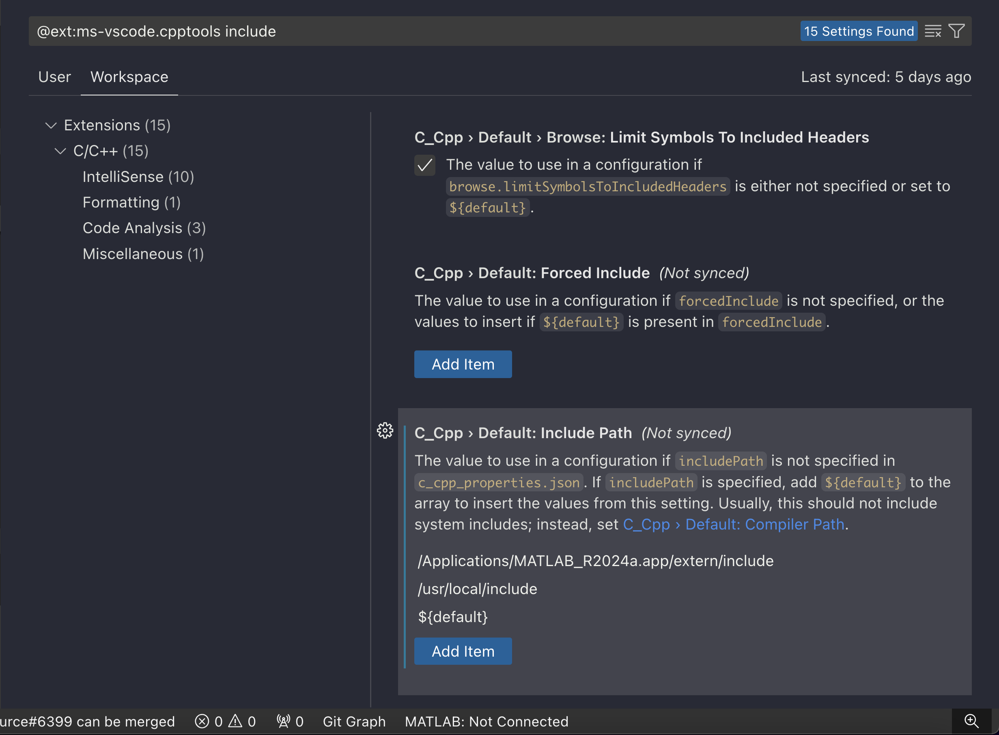

# Setting up VSCode for Matlab Mex Coding

[Matlab Tutorial Debugging Mex with VSCode](https://blogs.mathworks.com/developer/2018/06/19/mex-debugging-vscode/)

## Resolve `#include mex.h`

[Using Clang with Visual Studio Code](https://code.visualstudio.com/docs/cpp/config-clang-mac#_create-hello-world-app)

### Point to matlab extern include

#### Adding MATLAB extern to Intellisense C++ Include 

To ensure that the correct compilation is happening select `macos-clang-arm64`

