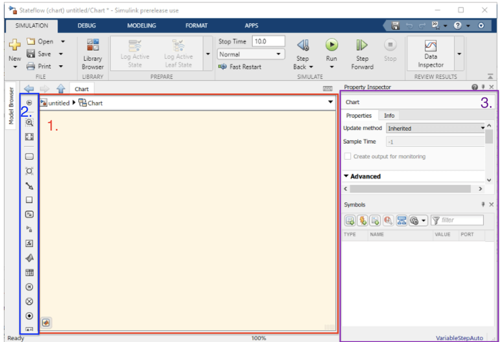

# Matlab Stateflow General overview

Stateflow machines can be utilized to integrate into Simulink models to define discrete actions based on model states. Communication to external databases and commands provide an excellent use case.

## [Basics of Stateflow](https://www.mathworks.com/help/stateflow/gs/stateflow-charts.html)

### Two fundamental elements:

1. States
2. Transitions

### Model Creation

`sfnew` - <b>S</b>tate<b>f</b>low New

```Matlab
sfnew redis_client
```

### Primary Stateflow Development Editor

|    |Editor Element  | Description      |
|:--:|:---------------|----------------------------|
| 1. | Chart Canvas   | Drawing area to create a chart by combining states, transitions, and other graphical elements.                           |
| 2. | Object palette | To the left of the canvas, displays a set of tools for adding graphical elements to your chart.                          |
| 3. | Symbols pane   | To the right of the canvas, add new data, events, and messages to the chart and resolve any undefined or unused symbols. |



### State Action Types

State actions - define what a Stateflow chart does while a state is active.

The most common types of state actions are entry, during, and exit actions:

| State Action Type |  Function |
|-------------------|-----------|
| `entry`  (`en`)   |  action during state activation (relative t0) |
| `during` (`du`)   |  action on a time step - not activation (relative t0) nor exit (relative tfinal) |
| `exit`   (`ex`)   | action during state de-activation (relative tfinal)|

### Transition Label Types

Transition labels - define what a Stateflow chart does when the active state changes

#### Condition-ConditionAction Label Type

```zsh
[Condition]{ConditionAction}
```
| Label elements   | Function |
|------------------|----------|
|`Condition`       | Boolean specifying transition |
|`ConditionAction` | Guards the transition is true - 