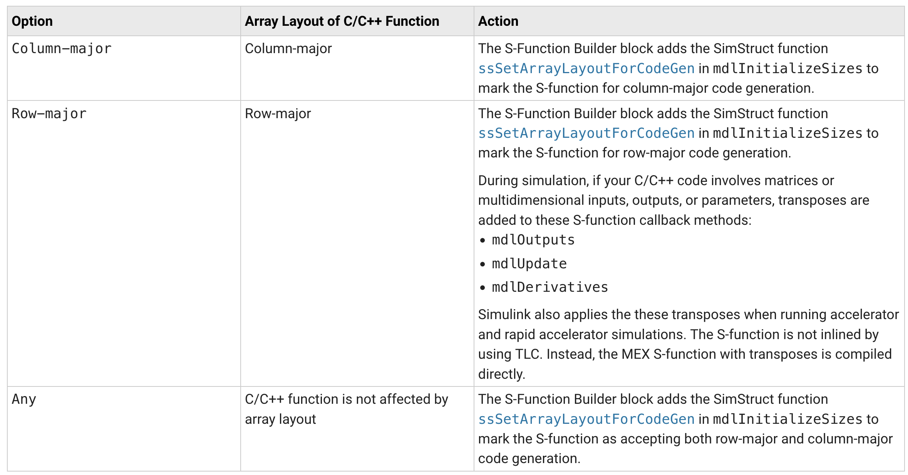
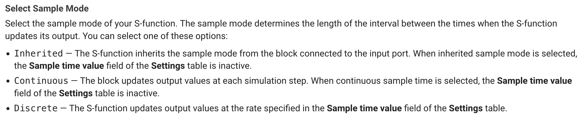
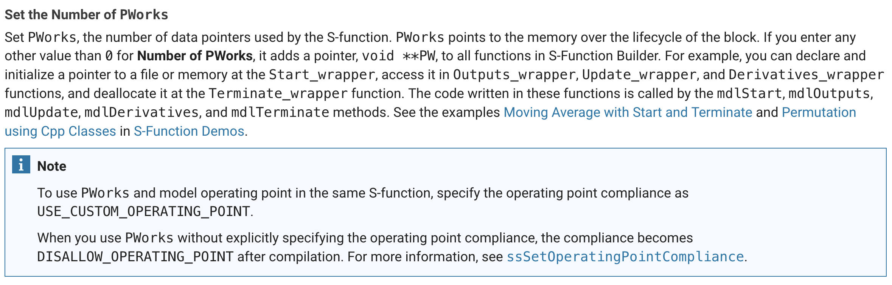
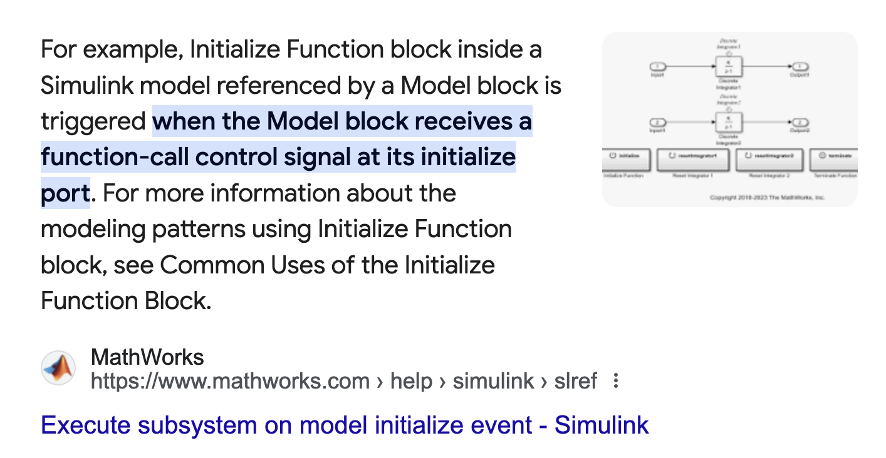
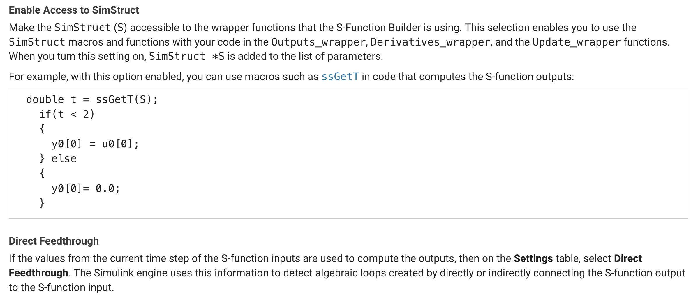
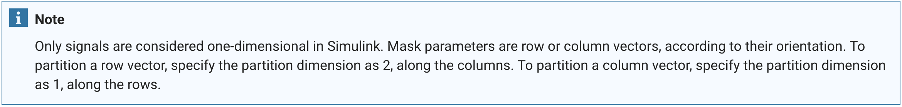
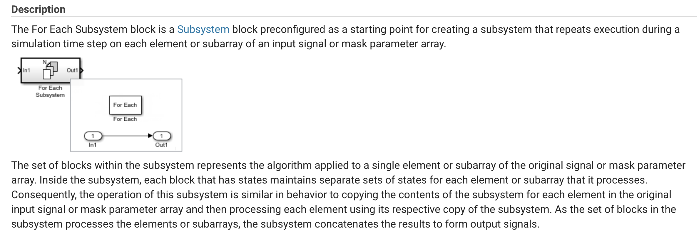

# Matlab S-function builder

## Row major considerations
Based on the table below, I have chosen a Column-Major implementation. I believe that all of our solvers are acting independently of each other and therefore do not require things like model derivatives etc. We can revisit this later.

## Sample Mode Selection

I have chosen inherited. I assume this gives us flexibility

## PWorks

Finally!!! I was soooo confused as to how to pass data between various stages of the life cycle. This is answer.

# Model Initialization

Based on model initialization, this is the appropriate time to connect to REDIS

# Enabling Access to the SimStruct, Direct Feedthrough vs Feedthrough

The SimStruct is required to pass data between elements. It is essential for our problem.

Based on the fact that the current inputs of the time step are used to compute the outputs, we must select Direct Feedthrough

# Handling Sub-system Arrays

This is a concept of where I think we need to go. The full Redis communication of what is the functionally the IDL is most flexible in an implementation when distinct blocks can be dropped in various places within the model, but then are reorganized with the parent block, the `For Each` block. This is not thread safe, however, and being that we are using a context to manage communication (although the data in that context is static), this is more about where we are going.

[For Each block](https://www.mathworks.com/help/simulink/slref/foreachsubsystem.html)

