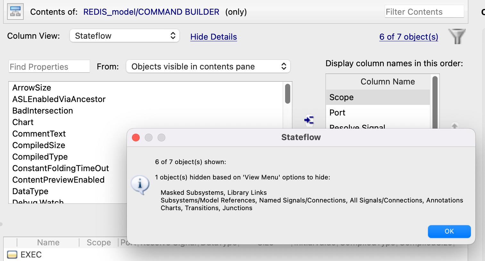
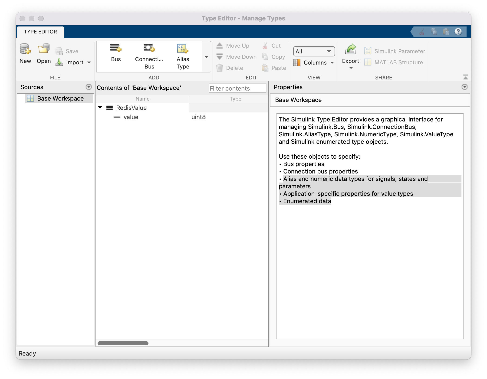

# Deciphering the Build Command

Examining the Stateflow of the `COMMAND BUILDER` block.
- Masked Subsystems, Library Links
- Subsystems/Model References, Named Signals/Connections, All Signals/Connections, Annotation Charts, Transitions, Junctions.



## Base Workspace

- Simulink.Bus: RedisValue
   - Managed by the `Simulink Type Editor`
   - Bus properties
   - Connection bus properties
   - Alias and numeric data types for signals, states and parameters
   - Application-specific properties for value types
   - Enumerated data




https://www.mathworks.com/help/simulink/ug/create-bus-objects-programmatically.html

```matlab
clear elems

elems(1) = Simulink.BusElement;
elems(1).Name = 'NestedBus';
elems(1).DataType = 'Bus: Sinusoidal';

elems(2) = Simulink.BusElement;
elems(2).Name = 'Step';
```

```matlab
TopBus = Simulink.Bus;
TopBus.Elements = elems;
```