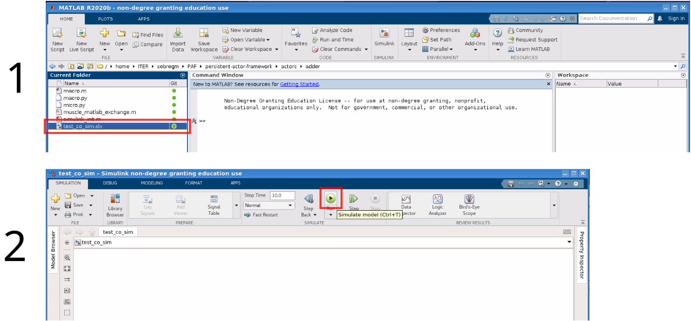

# Adder demo

The `adder` workflow is a simple workflow demonstrating MATLAB/SIMULINK
integration with MUSCLE3.

## Workflow overview

The workflow consists of two actors: *macro* and *micro*:

- The **macro** actor initializes itself, then executes a time integration loop.
  Time starts at `t=0` and is increased in two steps to `t=2`. Inside the loop,
  the *macro* actor communicates with the *micro* actor: it sends two randomly
  generated numbers to the *micro* actor, then waits for the result.
- The **micro** actor initializes itself and waits for the two numbers sent by
  the *macro* actor. It adds the two numbers and sends the result back. MUSCLE3
  restarts the model as often as needed to communicate with the *macro* actor.

## Message contents

The message from *macro* to *micro* is a list of two double-precision floating
point numbers. The return message is a single floating point number.

### Libmuscle data

`libmuscle` encapsulates data sent in messages. This works slightly different
in Python compared to the compiled languages (C++/Fortran):

#### Libmuscle data in Python

In Python there is no need to explicitly convert supported data types. The
following data types are supported:

- Builtin types: `bool`, `int`, `float`, `str`, `bytes`
- Containers: `tuple`, `list` and `dict` as long as all items in the container
  have a supported type
- Numpy arrays: these are automatically converted to `libmuscle.Grid` objects,
  for which some caveats apply. See the [Python API
  documentation](https://muscle3.readthedocs.io/en/latest/python_api.html) for
  details.

#### Libmuscle data in C++ and Fortran

In C++ and Fortran, data is encapsulated in `libmuscle::Data` objects. In either
language it is possible to send and receive the same data structures as in
Python, however you need to explicitly convert to and from `Data` objects. More
details can be found in the MUSCLE3 documentation:

- C++:
  [Tutorial](https://muscle3.readthedocs.io/en/latest/cplusplus.html#receiving-messages-and-dataconstref)
  and [API documentation](https://muscle3.readthedocs.io/en/latest/cpp_api.html)
- Fortran:
  [Tutorial](https://muscle3.readthedocs.io/en/latest/fortran.html#receiving-messages-and-dataconstref)
  and [API
  documentation](https://muscle3.readthedocs.io/en/latest/fortran_api.html)

## Running the workflow

First follow the instructions in [the repository readme](../../README.md). This
workflow is executed as part of the `ctest` tests, so if that step completed
successfully you can also run the workflow manually. The following commands run
the workflow. The Python implementation is used for the *micro* actor and the
Fortran implementation for the *macro* actor.

```Shell
# 1. Navigate to the adder workflow folder
cd persistent-actor-framework/workflows/adder
# 2. Run the workflow on this machine
muscle_manager --start-all adder.ymmsl \
    adder_impl_micro_python.ymmsl \
    adder_impl_macro_fortran.ymmsl
```

### Workflow output

See the same section of the [`helloworld` README](../helloworld/README.md).

### Workflow implementations

You can change between actor implementations by providing the `muscle_manager`
with different configuration (`ymmsl`) files. You must provide exactly one
configuration file each for the two actors. See below table for the options:

| Implementation | Micro actor                      | Macro actor
| -------------- | -------------------------------- | --------------------------------
| Python         | `adder_impl_micro_python.ymmsl`  | `adder_impl_macro_python.ymmsl`
| C++            | `adder_impl_micro_cpp.ymmsl`     | `adder_impl_macro_cpp.ymmsl`
| Fortran        | `adder_impl_micro_fortran.ymmsl` | `adder_impl_macro_fortran.ymmsl`
| MATLAB*        | `adder_impl_micro_matlab.ymmsl`  | `adder_impl_macro_matlab.ymmsl`
| SIMULINK       | N/A                              | `adder_impl_macro_simulink.ymmsl`**

\* `matlab` must be available in the `PATH` to run the matlab actors \
\** See the section below for instructions on running the workflow with SIMULINK

## Running the SIMULINK/python workflow on SDCC

A graphical environment is required to run SIMULINK interactively, so log on in
NoMachine and connect to SDCC. Once the desktop is loaded, open a terminal and
make sure you followed the instructions for *Running the workflow* above. When
the non-SIMULINK workflow runs successful, execute the following command to
start the SIMULINK workflow:

```Shell
# 1. Navigate to the adder workflow folder
cd persistent-actor-framework/workflows/adder
# 2. Load matlab2020b module
module load MATLAB/2020b-GCCcore-10.2.0-Java-11
# 3. Run the SIMULINK workflow on this machine
muscle_manager --start-all adder.ymmsl \
    adder_impl_micro_python.ymmsl \
    adder_impl_macro_simulink.ymmsl
```

After MATLAB opens, you need to execute the following steps. See below for a
screenshot:

1. Open the simulink file "test_co_sim.slx" by double clicking it. This may take
   a while.
2. Start the simulink model by clicking the Run button in the toolbar. You can
   see progress of the run in the status bar in the bottom of the window.

Note that the simulation can be run only once. After the simulation completes,
`muscle_manager` expects the actor to shut down, and the `micro` actor that
SIMULINK is communicating with is no longer available.


